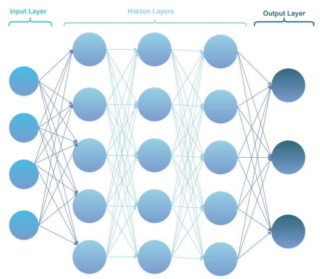

# INTRODUCTION TO ARTIFICIAL NEURAL NETWORKS :heavy_check_mark:

---

## Content
- a basic introduction to neural networks with the `first_nn.py` file
    - this python file's dataset is Iris dataset from kaggle: (https://www.kaggle.com/datasets/uciml/iris)
- there are 2 files for testing and training --> `test.py` and `train.py`
    - these files also use the same dataset but the test and train datasets are in splitted form.

